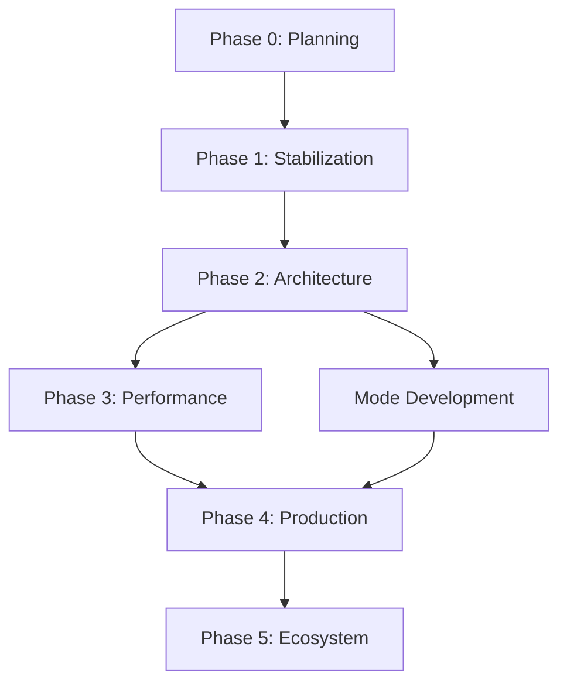

# DocHandler Enterprise Remediation Roadmap - Master Guide

## Overview
This document provides a comprehensive guide for AI-assisted investigation and remediation of DocHandler Enterprise. Each phase has a detailed investigation prompt in a separate artifact.

## Phase Artifacts Reference
1. **Phase 0**: `phase0-investigation` - Foundation & Planning (Week 1)
2. **Phase 1**: `phase1-investigation` - Critical Stabilization (Weeks 2-5)
3. **Phase 2**: `phase2-investigation` - Architecture Refactoring (Weeks 6-10)
4. **Phase 3**: `phase3-investigation` - Performance & Resilience (Weeks 11-13)
5. **Phase 4**: `phase4-investigation` - Production Readiness (Weeks 14-16)
6. **Phase 5**: `phase5-investigation` - Mode Ecosystem (Weeks 17-18)

## Critical Path Dependencies

## Investigation Instructions for AI

### General Guidelines
1. **Always start with Phase 0** - Understanding is critical
2. **Never skip critical fixes** in Phase 1 - They block everything else
3. **Document everything** - Future developers need to understand decisions
4. **Test continuously** - Every fix needs verification
5. **Consider future modes** - Don't create mode-specific solutions

### Investigation Approach
1. **Read the entire codebase** first
2. **Map dependencies** between components
3. **Identify patterns** that can be abstracted
4. **Find hidden coupling** between services
5. **Document assumptions** about behavior

### Code Analysis Priority
1. **Memory leaks** - Most critical, causes crashes
2. **Threading issues** - Causes unpredictable failures
3. **Security holes** - Compliance and safety
4. **Architecture debt** - Blocks future development
5. **Performance issues** - User experience

## Master Checklist

### Phase 0: Foundation & Planning ✓
- [ ] Current state documented
- [ ] Mode architecture designed
- [ ] Technical debt cataloged
- [ ] Migration strategy created
- [ ] Success metrics defined

### Phase 1: Critical Stabilization ✓
- [ ] COM memory leaks fixed
- [ ] Threading violations resolved
- [ ] Security vulnerabilities patched
- [ ] Error handling implemented
- [ ] Mode abstraction layer created

### Phase 2: Architecture Refactoring ✓
- [ ] Dependency injection implemented
- [ ] Mode registry functional
- [ ] MVVM properly implemented
- [ ] Pipeline architecture complete
- [ ] Testing infrastructure ready

### Phase 3: Performance & Resilience ✓
- [ ] Memory optimized
- [ ] Resource pooling implemented
- [ ] Retry policies configured
- [ ] Circuit breakers active
- [ ] Scalability features added

### Phase 4: Production Readiness ✓
- [ ] Monitoring integrated
- [ ] CI/CD pipeline automated
- [ ] Deployment strategy implemented
- [ ] Documentation complete
- [ ] Security hardened

### Phase 5: Mode Ecosystem ✓
- [ ] Mode SDK created
- [ ] Plugin system functional
- [ ] Marketplace API designed
- [ ] AI integration prepared
- [ ] Future architecture ready

## Risk Mitigation Strategies

### Technical Risks
1. **Memory Leak Persistence**
   - Mitigation: Continuous monitoring, automated leak detection
   
2. **Threading Complexity**
   - Mitigation: Standard patterns, extensive testing
   
3. **Mode Migration Failure**
   - Mitigation: Incremental approach, compatibility layer

### Business Risks
1. **Extended Timeline**
   - Mitigation: Parallel work streams, quick wins first
   
2. **User Disruption**
   - Mitigation: Feature flags, gradual rollout
   
3. **Cost Overrun**
   - Mitigation: Phased delivery, clear priorities

## Communication Plan

### Weekly Updates Should Include
1. **Progress**: What was completed
2. **Blockers**: What's preventing progress
3. **Risks**: New risks identified
4. **Metrics**: Memory usage, test coverage, etc.
5. **Next Steps**: Plan for coming week

### Stakeholder Checkpoints
- **End of Phase 1**: System stable, no crashes
- **End of Phase 2**: Architecture clean, tests passing
- **End of Phase 3**: Performance acceptable
- **End of Phase 4**: Production ready
- **End of Phase 5**: Future-proof platform

## Success Metrics

### Technical Metrics
- Memory usage < 300MB baseline
- Zero COM leaks in 24-hour test
- 99.9% uptime achieved
- <100ms mode switching time
- 80% test coverage

### Business Metrics
- 5+ modes available
- <1 day to add new mode
- 50% reduction in support tickets
- 100% user satisfaction
- ROI achieved in 6 months

## Tools Required

### Development Tools
- Visual Studio 2022+
- .NET 8 SDK
- Git for version control
- Azure DevOps / GitHub

### Testing Tools
- xUnit or NUnit
- Moq for mocking
- BenchmarkDotNet
- Application Insights

### Monitoring Tools
- Application Insights
- Azure Monitor
- PerfView for profiling
- dotMemory for leak detection

## Final Notes

### For AI Investigators
1. **Question everything** - Don't assume current code is correct
2. **Think long-term** - Solutions should last years
3. **Consider scale** - Solution should handle 10x current load
4. **Document why** - Not just what, but why decisions were made
5. **Test edge cases** - Normal cases are easy, edge cases cause failures

### For Human Reviewers
1. **Verify AI's understanding** - Ensure context is correct
2. **Check for over-engineering** - Simple solutions are better
3. **Validate security** - AI might miss subtle vulnerabilities
4. **Review performance** - Ensure optimizations make sense
5. **Confirm compatibility** - Changes shouldn't break existing users

## Next Steps
1. Begin with Phase 0 investigation using `phase0-investigation` artifact
2. Create detailed findings document
3. Review findings with stakeholders
4. Proceed to Phase 1 once approved
5. Iterate through all phases systematically

Remember: **Quality over speed**. A properly fixed system will serve for years.